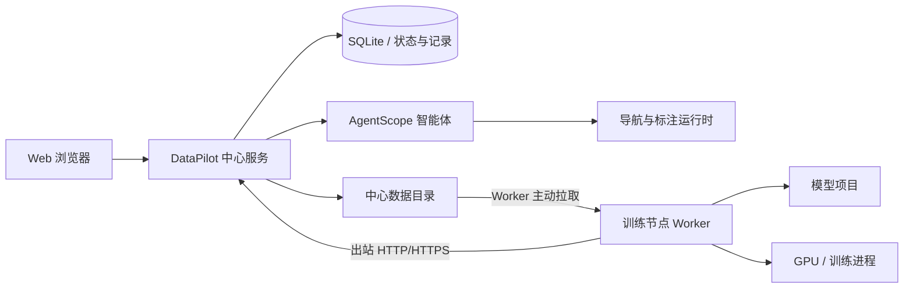

# DataPilot：VLA 数据闭环与模型训练平台

DataPilot 将导航数据处理、自动标注、人工复核、训练数据发布、训练节点管理和真实模型训练连接在同一个 Web 平台中。它的目标不是理解某一种模型，而是让数据工程师和算法工程师能够安全、清晰地完成从原始数据到可追溯模型版本的工作。

## 当前能力

| 模块 | 已实现能力 |
| --- | --- |
| Agent 工作流 | 用自然语言发起导航数据处理任务，查看计划、进度和结果 |
| 数据管理 | 管理日期数据、处理状态、发布状态和重置流程 |
| 自动标注 | 创建标注任务，人工修正与复核轨迹，查看历史修正结果 |
| 训练数据 | 查看并发布已复核数据；将已发布日期传输到训练节点；按日期划分训练集和测试集 |
| 训练节点 | 一次 SSH 授权完成 Worker 部署、更新、修复和卸载；查看 CPU、内存、磁盘和 GPU |
| 模型训练 | 登记模型族及参数定义，验证训练环境，选择 GPU，单阶段或多阶段真实训练，停止和恢复监控 |
| 训练观测 | 日志、Loss、学习率、Grad Norm、GPU 指标、失败诊断和 checkpoint 事件 |
| 模型版本 | 每次成功训练生成模型版本，保存配置快照、数据快照、阶段结果和最终版本模型目录 |

真实训练已经完成工程链路验收。测试/仿真模块目前仍是后续建设内容，不应被视为已经接入真实模型测试。

## 系统结构



- 中心服务负责页面、状态、任务编排、数据清单和模型版本记录。
- Worker 运行在训练节点上，只执行平台定义的固定操作，不开放任意 Shell 接口。
- 真实训练由 Worker 在训练节点启动；SSH 只用于安装、更新、修复和卸载 Worker。
- 模型项目负责理解自己的数据和训练逻辑，DataPilot 不修改模型结构，也不要求使用 Git。

## 环境要求

- Python 3.11 或更高版本；开发和部署环境推荐 Python 3.12。
- Node.js 24.18.0 和 npm 11.16.0；仓库中的 `.nvmrc` 固定 Node.js 版本。
- 需要使用智能体时，准备兼容 OpenAI API 的模型服务和 API Key。
- 执行导航、ROS、CUDA 或 GUI 业务脚本时，按实际服务器配置独立的旧业务运行时。

## 快速开始

### 1. 安装 Python 依赖

推荐使用仓库根目录的 `uv.lock` 创建可复现环境：

```bash
uv sync --extra dev
source .venv/bin/activate
```

也可以使用普通虚拟环境：

```bash
python3 -m venv .venv
source .venv/bin/activate
python -m pip install -e ".[dev]"
```

### 2. 安装前端依赖

```bash
nvm install
nvm use
cd frontend
npm ci
cd ..
```

### 3. 配置智能体

只有智能体相关功能需要这些变量：

```bash
export DASHSCOPE_API_KEY="你的 API Key"
export VLA_AGENT_MODEL="qwen3.5-plus"
```

兼容 OpenAI API 的其他服务可通过 `DASHSCOPE_BASE_URL` 和 `VLA_AGENT_MODEL` 配置。不要把 API Key 写进仓库或 `run-web.json`。

### 4. 启动 Web 服务

```bash
./scripts/run_web.sh start
```

默认访问地址：

```text
http://127.0.0.1:8765
```

常用命令：

```bash
./scripts/run_web.sh status
./scripts/run_web.sh logs
./scripts/run_web.sh restart
./scripts/run_web.sh stop
./scripts/run_web.sh foreground
```

`logs` 会持续跟踪日志，按 `Ctrl+C` 退出查看；`foreground` 适合本地调试。

## 服务端配置

`run_web.sh` 会读取当前系统用户的固定配置文件：

```text
~/.config/vla-data-juicer-agents/run-web.json
```

配置目录应为当前用户所有且权限为 `0700`，文件权限应为 `0600`。它是严格 JSON，不是 Shell 脚本。一个常见示例如下：

```json
{
  "WORKING_DIR": "/srv/datapilot/state",
  "VLA_DATA_AGENT_WEB_WORKING_DIR": "/srv/datapilot/state",
  "VLA_FRONTEND_NODE_BIN_DIR": "/home/service/.nvm/versions/node/v24.18.0/bin",
  "VLA_VLADATASETS_ROOT": "/srv/vla-datasets",
  "VLA_ANNOTATION_WORK_ROOT": "/srv/datapilot/annotation-work",
  "VLA_NAVIGATION_ODOM_V1_SOURCE": "/srv/datapilot/runtime/navigation_odom_v1/source",
  "VLA_NAVIGATION_ODOM_V1_MANIFEST": "/srv/datapilot/app/runtime/navigation_odom_v1/manifest.json",
  "VLA_NAVIGATION_WRITER_LOCK_PATH": "/srv/datapilot/locks/navigation-writer.lock",
  "VLA_TRAINING_DB_PATH": "/srv/datapilot/state/training.sqlite",
  "VLA_TRAINING_CENTER_BASE_URL": "https://datapilot.example.internal"
}
```

注意：

- `VLA_TRAINING_CENTER_BASE_URL` 必须能被所有训练节点访问；正式环境推荐 HTTPS。
- `DASHSCOPE_API_KEY` 不在允许写入该 JSON 的配置项中，应由启动服务的环境或凭据管理器注入。
- 真实训练默认开启。需要临时关闭时，在启动服务的环境中设置 `VLA_TRAINING_REAL_EXECUTION_ENABLED=0`；该变量不属于 `run-web.json` 白名单。
- `VLA_TRAINING_DEV_ADMIN=1` 是无正式身份系统时的开发管理身份，只适合受控环境。
- 已有环境变量优先于 JSON 中同名配置。
- `npm ci` 需要在首次部署或 `frontend/package-lock.json` 变化后执行；启动脚本负责构建前端，不负责安装依赖。

## 数据闭环

典型数据流程如下：

1. 数据进入平台后执行同步、轨迹和标注前处理。
2. 自动标注生成轨迹，人工在复核工作台修正并确认。
3. 已复核日期进入训练数据页，用户检查后发布。
4. 已发布日期可传输到模型绑定的训练节点。
5. 新建训练时，用户从该节点已有的日期中选择训练集和可选测试集。
6. 平台生成 `dataset-manifest.json`，模型项目自行读取并转换为所需样本。

导航命令行诊断入口仍可单独使用：

```bash
vla-nav-agent plan --date 20270605 --dry-run --no-llm
vla-nav-agent run --date 20270605
```

执行 ROS、CUDA、OpenCV、Open3D 或旧业务代码时，不要把这些依赖导入 Agent 的 Python 环境。通过以下变量将业务脚本放到独立子进程运行时：

```bash
export AGENT_DATA_PYTHON="/usr/bin/python3.8"
export AGENT_DATA_ENV_SETUP="/path/to/setup_data_runtime.sh"
export VLA_GT_DOG_ROOT="/media/heying/hy_data2/GT_dog"
```

## 训练节点与 Worker

训练节点登记时，用户提供一次 SSH 连接。系统使用该连接检查主机指纹和部署条件，再安装 Worker。

- Worker 与训练进程长期使用本次 SSH 登录账号运行。
- 如果该账号是 `root`，训练进程也会是 `root`；账号权限和选择由用户负责。
- 安装系统服务需要 `root`、免密 sudo 或可用的 sudo 密码；权限不足时会明确提示用户更换账号。
- SSH 密码只用于当前操作，不写入节点记录。
- Worker 使用出站连接联系中心服务，训练节点无需开放额外入站端口。
- 更新 Worker 不会主动结束仍在运行的训练进程；新 Worker 会根据本地记录重新核对任务。

Worker 支持资源采集、目录浏览、托管数据传输、真实训练启动与停止、日志和指标上报、checkpoint 记录以及版本产物检查。部署细节见 [Training Worker 部署说明](deployment/systemd/README.md)。

## 模型登记与训练

模型登记入口位于“新建训练任务”页。模型族保存当前训练定义，包括：

- 绑定训练节点；
- 工作目录、启动方式、训练入口和运行环境；
- 输出根目录及产物输出参数；
- 可配置参数、范围、依赖和阶段输入参数；
- DataPilot 托管数据或模型自行管理数据。

保存模型配置后，平台会在训练节点验证目录、入口、运行环境和输出权限。修改配置只影响以后创建的任务，历史任务保留不可变快照。

每次真实训练会生成一个模型版本。单阶段和多阶段训练只生成一个版本；多阶段按顺序执行，后续阶段可使用上一阶段输出目录。成功训练的最终阶段目录进入“模型版本”资产库，可在后续测试模块中作为默认模型产物。

模型项目接入 `--dataset_manifest`、输出目录、指标和 checkpoint 事件的方法，见 [模型项目接入指南](docs/training-model-integration.md)。正式 JSON 契约位于 `contracts/training/`。

## 本地前端开发

先在仓库根目录启动后端：

```bash
vla-data-agent-web --host 127.0.0.1 --port 8765 --working-dir ./.djx
```

再启动 Vite：

```bash
cd frontend
npm run dev
```

Vite 会把 `/api` 和 WebSocket 请求代理到本地后端。

## 命令行入口

| 命令 | 用途 |
| --- | --- |
| `vla-data-agent` | 对话式主智能体 |
| `vla-nav-agent` | 导航任务计划、执行和诊断 |
| `vla-data-agent-web` | Web 后端 |
| `vla-agent-eval` | Agent 评估 |
| `vla-annotation-operator` | 标注运维命令 |
| `vla-navigation-operator` | 导航运维命令 |
| `datapilot-training-worker` | 训练节点 Worker |

## 测试与构建

后端完整测试：

```bash
pytest -q
```

前端测试和生产构建：

```bash
cd frontend
npm test
npm run build
```

常用基础检查：

```bash
python -m compileall -q src
git diff --check
```

## 目录说明

```text
src/vla_data_juicer_agents/   Python 后端、Agent、标注、训练和 Worker
frontend/                     React / TypeScript Web 前端
runtime/                      冻结的业务运行时及清单
deployment/                   服务部署参考
contracts/                    训练数据和训练事件 JSON Schema
scripts/                      Web 服务与运维脚本
tests/                        Python 测试
frontend/e2e/                 前端端到端测试
```

## 相关文档

- [模型项目接入指南](docs/training-model-integration.md)
- [导航计划 Agent 指南](docs/navigation-plan-agent-guidance.md)
- [Training Worker 部署说明](deployment/systemd/README.md)
- [导航 Odom 运行时说明](runtime/navigation_odom_v1/README.md)

## 重要边界

- 平台不会理解或修改模型结构、权重格式和训练算法。
- 平台记录“最终阶段输出目录”，不自动判断最佳 checkpoint。
- GPU 利用率和显存是给用户选择资源的参考；平台只阻止自身任务的租约冲突，不推断同事的外部训练是否可中断。
- Worker 不提供任意 Shell 或任意远程命令能力。
- 当前开发管理身份不等同于正式认证授权系统；正式多用户上线前仍需接入身份和权限方案。
